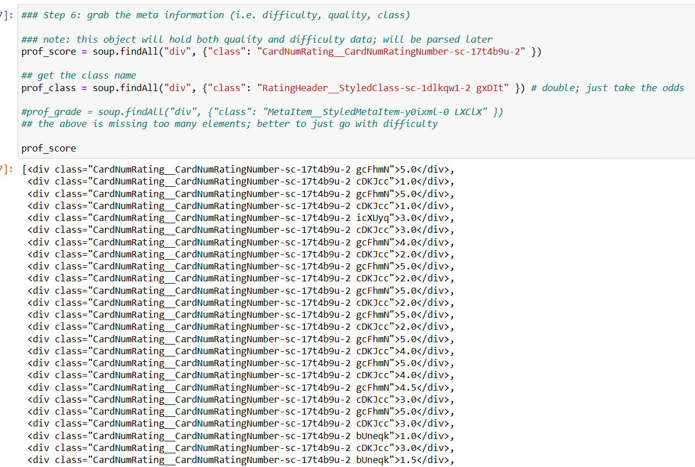
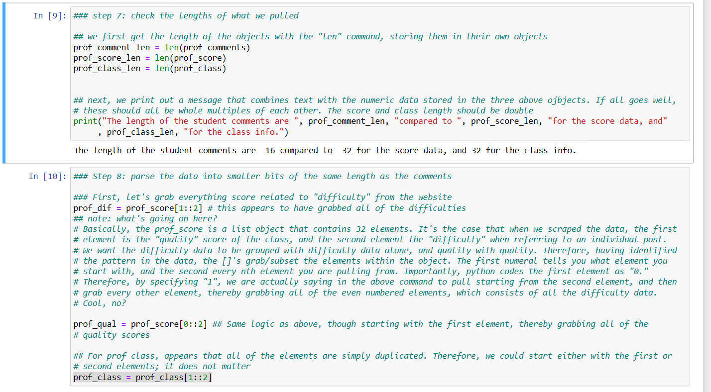
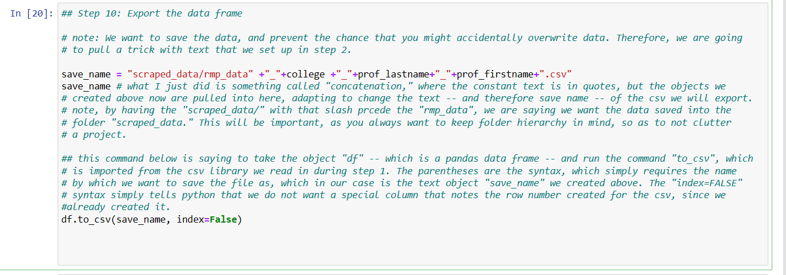

# set_scraping
A repository for scraping and coding student evaluations of teaching

## Part 1: Identifying the sampling frame 

The goal of this project is to scrape data/comments on professors with the likely highest degree of variance for professors/instructors. We shall do that by identifying all professors at the two major public universities of Ohio State University and the University of North Carolina at Chapel Hill. Our goal shall be to identify all faculty within these departments at the schools: (1) political science, (2) psychology, (3) sociology, and (4) public health. These are chosen based upon their potential to see the mix of substantive and methodological classes and faculty characteristics likely to trigger a range of comments. In order to efficiently scrape these data, please adhere to the following steps. 

### Step 1: Log onto the program's website

Employ a google search to find the program of interest. Should be done by typing in the name of the university, followed by the name of the program/major of interest. Follow this up by looking for the directory page. This can be found either by looking for the directory as typically found under the "About" section for the major's website, the "People" tab, etc. 

### Step 2: Record faculty characteristics from university page 

Upon finding the way to the people/directory page, these faculty need to be recorded regarding their characteristics. Therefore, log into your ONU account and access the google sheet "faculty characteristics web scraping" page. 

https://docs.google.com/spreadsheets/d/1pa-gE1O9HhYUPkb92OphCqy3q0fmA0j67CoQ-BfXRl8/edit?usp=sharing

For each professor that shows up, you'll want to record the information regarding: college, prof_firstname, prof_lastname, program, male, non_white, and link_rmp. The first sheet labeled "faculty" contains the data entry page, and the sheet "codebook" contains the values that the fields must take. For a given professor, simple observation and/or clicking their profile will contain the information of interest. 

## Step 3: Find Rate My Professor Link 

Click on the link to the Rate My Professor link here: 

https://www.ratemyprofessors.com/

Upon clicking the link, filter the university to the one of interest (Ohio State or University of North Carolina at Chapel Hill).

Follow up by typing/copying and pasting the name of the faculty member of interest to the Rate My Professor search engine. This should provide results of the name matches. Click on the matching result. 

Upon clicking said page, the only item that you'll need to copy and paste of interest will be the link for the page. These shall be used to scrape all of the data in an automated manner so that you do not have to. Of esepcialy importance are the last digits following the forward slash. These uniquely identify a professor in such a way that knowing it alone will allow for the easy update and scraping for a given RMP page. 

Upon the collection of this information, you can proceed to the next professor. Once all of these professors are acquired, we can proceed with the text scraping, to be followed by the coding of their comments. 

# Part 2: Scraping Rate My Professor Data 

These instructions shall go over the logic of the Rate My Professor scraping process, in addition to some of the basics of python coding. These can be found in the rate_my_prof_scraping_template.ipynb and automated_python_rmp_scraper.ipynb scripts. While not exhaustive, it should hopefull act as a starting point as to what to do. Additionally, look to the comments for insight. 

## Step 1: Importing the packages 

The first step imports the packages/libraries of interest. These comprise of:

* sys - System-specific parameters and functions; good for generic functions across a wide spectrum 
* requests - A package designed for scraping and parsing text data 
* BeautifulSoup from bs4 - an extension to aid in parsing html and xml data from web pages 
* itertools - Allows for the iteration within loops by length and across multiple lists at once 
* pandas - necessary for reading in, creating, and manipulating data frames
* csv -  for importing/exporting csvs 

All of these are fairly standard and should not required custom install. In the event that they do and you are working from Anaconda, the command,
!{sys.executable} -m pip install PACKAGENAME 
will allow you to install as needed. 

## Step 2: provide URL and school-instructor characteristics 

This bloc provides the url name that will be read in and scraped, in addition to the names of the university where the instructor teaches, and instructor name. Within the script rate_my_prof_scraping_template.ipynb, these are entered by hand to be updated. However, the faculty characteristics google sheet is read in for the automated_python_rmp_scraper.ipynb, thus allowing for no user input whatsoever. For the purpose of the demonstration of the logic of scraping, the instructions shall proceed in line with the rate_my_prof_scraping_template.ipynb script. 

## Step 3: Set up request for url 

The primary command in step 3 is page = requests.get(url). The command stores the url into the object "page," which transforms the url string via the "get" command, as stored in the "requests" library. 

## Step 4: Extract XML/HTML elements 

The 4th step employs the "BeautifulSoup" function from bs4, which transforms the "page" object. This command takes all of the xml/html code as seen when a page is inspected, and stores it into the soup object. As of right now, the content is not at all cleaned and nearly unreadable.  

## Step 5: Extract comments 

Step 5 is where the user needs to at least once identify the patterns within the xml/html code that consistently identify the comment portion of the RMP website. 
This can be done by first, highlighting the relevant portion of the page. In this case, we want to highlight some section of the comment, as seen below. From there, right click to bring up a menu. From there, select the "inspect" option. 

Following this, you'll see a panel to the right with the xml/html code. What's important is that what you highlighted on the page itself will correspond to code within the inspection panel. Right click on this portion and click "copy element", then paste into your python script. 

Once you paste into your script, you'll need to clean some things up. What's of interest in what we copied is everything within the "<>" signs, which in our case is -  
. Note the structure of the whole element copied and pasted over
  
 
Heavy weighted classes.  Would not recommend anyone to take her classes.  They're boring as is her teaching style and personality.  I took two of her classes.  She's only there for her research funding.  Snobby too, with no reason to be.

 
  
 We see that the section within "<>" signs act as a tag, which is then followed by the actual comment as seen on the RMP website. If we were to click and inspect each and every comment, we would see that this tag pattern is the same. Therefore, we can plug this into the "findall" command, as applied to the "soup" object. Note the syntax/arguments for the findall command. The first argument preceding the comma needs to be the first word/ngram following the "<" sign. Note that this does vary, with other sections of the page denoted by things like "span" and such instead of "div". 
   
 In any case, the section following the comma and within the brackets "{}" are the "class": followed by the tag as seen above. All of this in combination effectively tells python to extract only that text that follows a line/division where the string pattern as you found matches. 
 
 
   
  Upon completion, you'll now have all of the comments within the object "prof_comments". Note that you'll do a similar effort for the other sections of interest, including difficulty and quality ratings, in addition to class name. 
   
## Step 6: Extract quality, difficulty and class information
   
 Following the same logic/process within step 5, we proceed to find the patterns for the quality of the class, reported difficulty, and class name. These patterns are all found via the same inspection process. However, it is important to note a problem here. Unlike the comments, the patterns for the ratings and such vary in text patterns based upon the score. For example, the text pattern for the section of the page from a high quality rating is written as, 
   

4.5

   
 However, the text for a low quality rating is written as, 

3.5

   
 It appears that the last 6 characters differ, depending on rating. While everything else is the same, we see that difficulty follows a very similar pattern, 
   
 

   
  Where everything is the same with a high quality rating besides the last 6 characters. Therefore, if we excise the last six characters, the new object created by the findall command would store the quality and difficulty ratings all in one object. If we print the list with the quality and difficulty ratings combined, we fortunatel find a pattern: the first digit is the quality rating, followed by the difficulty within the same box from the website, followed by another quality rating from the next box, then the difficulty rating, etc. Therefore, it looks like we can reasonably parse the data into their separate dimensions, which we will do in the next step. 
   
   
 
   
 ## Steps 7 and 8: parse the quality, difficulty and class data 
   
 Prior to parsing the data, we first check the lengths of these lists in order to ensure compatability. These should be exactly twice the length of the comment list. Printing these out reveals that they are. 
   
 
   
  Therefore, we parse according to the patterns found earlier. For the quality data, we subset via the command, 
   
  prof_qual = prof_score[0::2]
   
  Which says that we want to create a new object, prof_qual, from a subset of the prof_score object created in step 6. The brackets [] are used to grab a subset, with the 0 representing the first element of said list. The :: in the middle notes that we want to grab every element following some type of pattern, with the 2 at the end signifying that we want every other element. In effect, the command allows us to grab every other element starting with the first, thus grabbing all of the odd elements, which correspond to the quality data. The difficulty data in turn uses the same command, although this time starting with the second element, which in python is noted by a 1 instead of a 2. Finally, the class data ends up just having repeated elements, so we likewise just use the same command to grab every other element. Following this, we now have three lists of data all of the same length. 
   
## Step 9: Compile the data frame via a loop 
   
 In the penultimate step, we now take all of the data that we gathered and store into a common data frame via a loop. This is where the itertools, csv, and pandas libraries come into play. 
 
  The section first creates an object to store information inside, d1. This is created via the empty brackets. The first line of the loop itself, 
   
   for i, element in enumerate(prof_qual):
  
   Says that we want to run the following processes for however long the object prof_qual is, which in this case is 16. The reason for the "for i" section of the loop is to allow us to grab the ith element from other objects besides prof_qual. If we were to go with the standard non-itertools version of element, we would grab instead the ith element within the prof_qual list alone. 
   
   The command within the loop "d1.append" says that we will add rows and columns to the as of now empty d1 object. 
   
   In turn, all of the words in quotations and followed by a colon is where a new column is created. The following object with an i in brackets notes that we are pulling the ith element from the lists/objects of interest. Note that most of these have the get_text() command, which simply cleans all of the text within the ith element. 
   
    
  
   
   When the loop ends, this is stored into the df object, as transformed by the pd.DataFrame command. This creates a clean data frame object that can be exported. 
   
## Step 10: Export the data 
   
The final step is to export the data as a csv (i.e. excel) file. In order to prevent the overlap of the data, the user inputted data on university and instructor name are combined into a string object "save_name." These will be stored in the "scraped_data" folder within github, which will prevent clutter. Finally, all of this is exported via the "df.to_csv" command, which exports the df object to the location and name as posited in the save_name object. From there, the data has been scraped!
   

    
   
  
 
   
   
   
  

